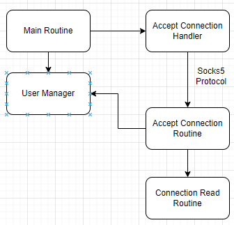

# Auth-Based Proxy built with Golang

Yet Another Socks5 proxy. But we offer Authentication, Auditorium and Access Control. Design Pattern Reference from 
15-440 Bank Concurrency Model.

## start
``go build github.com/rayguo17/go-socks/cmd``

## config
``vim user/config.json``

add user as you wish.

## feature

* Now we only support username/password socks5 authentication.
* Meanwhile, only support adding user and deleting user
  through
  modifying ``config.json`` file.

## Layout

There are three individual module which communicate with each other with channel.
We utilize channel to "register" commands. So that the command will be executed in order. Guarantee the data integrity.

### test case

1. Use Curl to showcase different username/password authentication.
2. Use Browser to showcase blacklist/whitelist, and also the connection monitor.
3. Showcase wrong behavior, when handling socks5 protocol.
4. HTTP Server protocol handling...
5. Graceful shutdown.
6. config file/ http handle 
7. User byte count
8. User log file.

