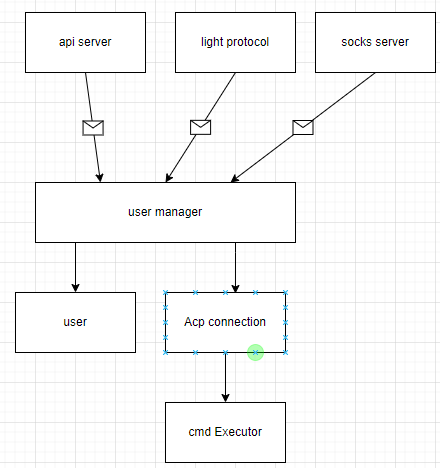

# Yet Another Socks5 proxy Server

Yet Another Socks5 proxy Server. But we offer Authentication, Auditorium, Access Control, Traffic Obfuscation and Encryption. Design Pattern Reference from Golang-go concurrency model.

## Keypair generation

`./setup.sh `

## Start

`go build github.com/rayguo17/go-socks/cmd`

## Config

`vim user/config.json`

add user as you wish to.

## feature

- Support username/password socks5 authentication.
- Configuration through config.json and user.json.
- Can choose to send traffic to remote relay server or handle it locally, can have multiple-hop relayer.
- Implemented Backdoor, could have a direct look at internal data structure (user and accepted connection).
- Share Memory by communication, utilize go channel to handle concurrency.
- Relayer traffic utilize tor obfs4 traffic obfuscation technic, add more privacy.
- Implement Restful Api server to change underlying user and connections.
- Auto-generate x25519 keypair as light server identification.

## Layout

There are three individual module which communicate with each other with channel.
We utilize channel to "register" commands. So that the command will be executed in order. Guarantee the data integrity.

### Ongoing Task

### feature implementation

- [x] Use Curl to showcase different username/password authentication.
- [x] Use Browser to showcase blacklist/whitelist, and also the connection monitor.
- [x] Showcase wrong behavior, when handling socks5 protocol.
- [x] HTTP Server protocol handling...
- [ ] Graceful shutdown.
- [ ] Can choose remote encryption or pure traffic
- [ ] should be able to choose port to open api server
- [ ] fix http add, delete and list user.
- [ ] fix backdoor monitoring, show remote connection and user property.
- [x] config file/ http handle
- [x] User traffic byte count
- [x] User log file.
- [x] Integrate tor obfs4 traffic

### Show Case

1. show setup bash script, create key pair
2. show config.json and user.json, for protocol setup and user setup
3. start server, showcase both anonymous and user authentication. handle traffic
4. showcase blacklist, white list, blocking user traffic.
5. showcase log, and log to std out or discard or dedicated file.
6. showcase remote server connection, use wireshark to demostrate we obfuscate relayed traffic. showcase we now are able to circumvate firewall censoring.
7. showcase backdoor monitoring, show active server and active user
8. showcase http api server, use postman to interact with user.
9. delete user, gracefully handle, mark as deleted, still keep the user, until all the connection is end. (detail)
